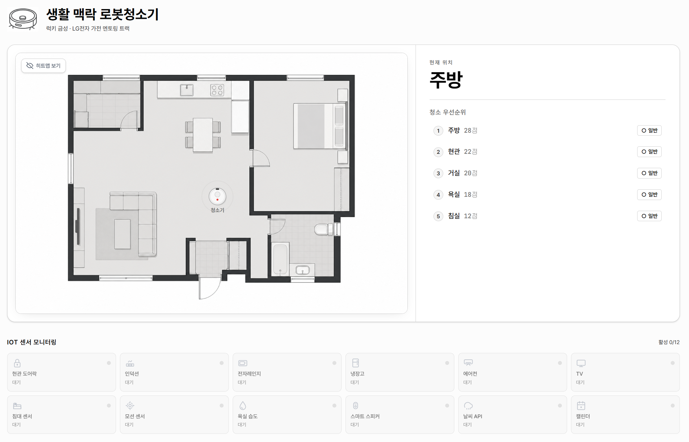

# Lumos — 생활 맥락 로봇청소기

> **IoT 멀티센서로 "지금 어디를·왜 청소해야 하는가"를 추론하고, 그 이유를 자연어로 설명하는 로봇청소기 의사결정 시뮬레이터.**
> 성균관대 RISE × LG전자 가전 멘토링 트랙 · 팀 럭키 금성 4인 · 4주 (2026-05) · 웹 + 모바일 + FastAPI 백엔드.

<p>
  <a href="https://robot-cleaner.askewly.com/">라이브 데모</a> ·
  <a href="./exports/rehearsal-deck/index.html">발표 덱</a> ·
  <a href="./TECHNICAL_PLAN.md">기술 기획서</a> ·
  <a href="./BUSINESS_PLAN.md">사업 기획서</a> ·
  <a href="./ROADMAP.md">4주 회고</a>
</p>



---

## 포트폴리오 요약

| 항목 | 내용 |
|---|---|
| 내 역할 | 팀장 · 제품/기술 기획 · FastAPI 백엔드 · LLM 설명 레이어 · Next.js 웹 · Flutter 앱 · 배포 · 발표 스토리/덱 |
| 핵심 결과 | 8개 생활 시나리오, IoT 센서 추론 모드, 24h 타임라인 재생, rule-based scoring, LLM explanation fallback |
| 기술 포인트 | raw 센서는 edge에 두고 high-level event만 API로 넘기는 Privacy-on-Edge 경계, JSON 카탈로그 기반 확장 구조 |
| 검증 | backend pytest 57 passed, deterministic scoring golden tests, cached LLM responses for demo resilience |
| 산출물 | [라이브 데모](https://robot-cleaner.askewly.com/) · [최종 산출물](./exports/) · [기술 기획서](./TECHNICAL_PLAN.md) |

## 무엇을 만들었나

스케줄 청소·맵 분할 청소를 넘어, **생활 맥락**(시간·요리·취침·날씨·손님 일정)을 결합해 청소 우선순위를 결정하는 엔진을 만들고, 같은 백엔드를 웹·모바일 두 클라이언트가 공유하도록 했다.

- **맥락 인식 (context-aware).** "비 오는 날 귀가 → 현관 먼저, 침실 제외", "취침 30분 전 → 침실·거실 제외, 현관·주방만 저소음" 처럼 *상황*에 따라 어디를 청소할지 결정한다.
- **Privacy-on-Edge.** ML·rule 추론은 디바이스(엣지)에서 끝내고, 클라우드로는 high-level event(`cooking_done`, `user_returned`…)만 전송한다. 카메라·오디오·인체 위치 같은 raw 신호는 외부로 나가지 않는다.
- **결정론 + 설명 가능.** 점수 계산은 100% rule-based(재현·디버깅 가능)이고, LLM은 *점수표 → 자연어 설명*만 담당한다. LLM이 죽어도 룰만으로 동작한다.

## 라이브

| | |
|---|---|
| 웹 시뮬레이터 | https://robot-cleaner.askewly.com/  (backup: https://cleaning-context.vercel.app/) |
| API 헬스체크 | https://cleaning-context-backend.onrender.com/api/health |
| 모바일 | Flutter 앱 (`mobile/`) — 웹 프리뷰 동작, APK 산출 |

> 백엔드는 Render 무료 플랜이라 첫 요청은 콜드스타트(~30s)가 있을 수 있다. 프론트가 폴링 + 스피너로 대기 처리한다.

## 시스템 — 6-Layer 파이프라인

```
[IoT 센서 — 도어락 · 인덕션 · 냉장고 · 에어컨 · CO₂ · 모션 · …]
   │  raw readings                                    (Sensor Layer)
   ▼
[Rule + (설계) ML 추론]
   │  high-level events: cooking_done · user_returned · pre_sleep_30min …   (Event Layer)
   ▼
[Rule-based Scoring]  ← 결정론적 · 재현 가능 · golden test 고정     (Decision Layer)
   │  방별 우선순위 점수 breakdown
   ▼
[LLM Explanation]     ← gpt-4o-mini · 점수표를 자연어로            (Explanation Layer)
```

- **Sensor** — 12종 IoT 센서 카탈로그(`sensors.json`) + 13종 추론 규칙(`sensor_inference_rules.json`). raw=엣지, 결과=클라우드 분리.
- **Spatial** — 5개 공간 + 속성(오염도·사용 빈도·소음 민감도).
- **Behavioral / Context** — 사용자 행동·이벤트 + 시간/날씨 맥락.
- **Decision** — `scoring.py` 결정론적 점수 엔진. 동일 입력 → 동일 우선순위 100%.
- **Explanation** — 4종 시나리오 응답은 디스크 캐시(`cached_responses/*.json`)로 두어 발표 중 LLM 장애에도 응답 보장.

## 주요 엔지니어링 결정

| 결정 | 이유 |
|---|---|
| **점수는 rule, 설명만 LLM** | 의사결정의 재현성·디버깅 가능성 확보. LLM은 hallucination 위험이 있어 *판단*이 아닌 *번역*에만 사용. |
| **새 센서·룰 = JSON만 수정** | 코드 분기 없이 `sensors.json` / `sensor_inference_rules.json` / `scoring_rules.json`만 고치면 반영. 새 이벤트·센서 추가 30분 이내(확장성 KPI). |
| **Privacy-on-Edge 경계** | Sensor=raw는 디바이스, Event=결과만 클라우드. 규제 친화 + LG 차별화 포인트. |
| **응답 디스크 캐시** | 데모 시나리오는 미리 캐싱 → 콜드스타트·LLM 장애에도 시연 안정성 확보. |
| **웹·모바일 단일 백엔드** | API 응답 스키마 단일 출처, 두 클라이언트(Next.js·Flutter)가 같은 계약 공유. |

## 데모 시나리오 (8종 라이브)

| 시나리오 | 입력 | 핵심 의사결정 |
|---|---|---|
| 비 오는 날 귀가 | 20:30 · 비 · 귀가 · 취침 2h 전 | 현관 우선 + 침실 제외 |
| 요리 직후 | 19:20 · 요리 완료 · 거실에 사용자 | 주방 즉시 + 거실 지연 |
| 취침 직전 | 22:50 · 취침 30분 전 · 침실에 사용자 | 침실·거실 제외 + 현관·주방 저소음 |
| 손님 방문 예정 | 17:00 · 2시간 후 방문 | 거실·현관 우선 |
| 택배 도착 · 식사 후 · … | (외 4종) | — |

추가로 **직접 입력 모드** + **IoT 센서 추론 모드**(`POST /api/infer-events`) + **하루 24h 타임라인 재생**(센서→이벤트→점수→로봇 이동 연동).

## 기술 스택

| 영역 | 스택 |
|---|---|
| 백엔드 | Python 3.12 · FastAPI · Pydantic v2 · pytest |
| LLM | OpenAI SDK (Timely GPT bridge) · gpt-4o-mini |
| 웹 | Next.js 15 (App Router · React 19) · TypeScript strict · Tailwind v4 · inline SVG(차트 라이브러리 없음) |
| 모바일 | Flutter 3 · Riverpod · Dio · go_router |
| ML | scikit-learn — 사용자 위치 추정 분류기 *(설계 완료, 운영은 heuristic fallback — 아래 참조)* |
| 배포 | Render(백엔드) · Vercel(웹) — `main` push 시 자동 |

## 결과

- ✅ **8 시나리오 + 타임라인 재생** 웹·모바일 라이브 동작
- ✅ **결정론적 스코어링** — 동일 입력 우선순위 일치 100%, golden test로 고정
- ✅ **응답 ≤ 5s** (캐시 적중 시 즉시), LLM 장애에도 룰 기반 폴백
- ✅ **확장성** — 센서·이벤트 JSON 추가만으로 신규 시나리오 반영
- 🔶 **ML 위치 추정** — CASAS hh106 데이터셋 기반 v3 설계 완료(`docs/CLEANING_DECISION_ALGORITHM.md`). 학부 일정상 모델 학습은 미완으로, 운영은 동등 입력을 받는 **heuristic fallback**으로 동작. ML 경로 테스트는 학습 모델 도입을 게이트로 둠.

## 디렉터리

공개 포트폴리오용 핵심 진입점은 `README.md`, `frontend/`, `backend/`, `mobile/`, `docs/`다. `exports/`는 제출·발표 최종 산출물을 보존한 폴더라 실행에 필수는 아니다.

```
backend/    FastAPI — routers · schemas · services · data(JSON 카탈로그) · tests
frontend/   Next.js 웹 시뮬레이터
mobile/     Flutter 앱
docs/       PRD · TRD · IOT_DOMAIN · SCORING_RULES · CLEANING_DECISION_ALGORITHM …
exports/    최종 PDF · 인터랙티브 발표 덱
```

보존 문서: `CLAUDE.md`는 개발 당시 AI 에이전트 작업 규칙을 남긴 동결본이고, `ROADMAP.md`는 종료 후 회고와 현재 공개 정리 milestone을 함께 담는다.

## 로컬 실행

```bash
# 백엔드
cd backend && python -m venv .venv && .venv/Scripts/activate
pip install -e . && cp .env.example .env       # TIMELY_API_KEY 채움
uvicorn app.main:app --port 8123 --reload

# 웹
cd frontend && pnpm install
NEXT_PUBLIC_API_URL=http://localhost:8123 pnpm dev

# 모바일 (웹 미리보기)
cd mobile && flutter run -d chrome --web-port 8770

# 테스트
cd backend && pytest              # 룰·스코어링·센서·시나리오
cd frontend && pnpm typecheck
cd mobile && flutter analyze && flutter test
```

`TIMELY_API_KEY`가 없어도 rule-based scoring과 캐시된 데모 응답은 동작한다. 실시간 LLM 설명만 fallback으로 전환된다.

## 팀 — 럭키 금성

| 이름 | 역할 |
|---|---|
| **전유성** (팀장) | 총괄 · 백엔드 · LLM · 웹/모바일 · 배포 · 발표 스토리·덱 |
| **김준성** | 데이터 · 시장·재무 분석 · 사업 기획서 |
| **박주상** | ML 위치 추정 모델 설계 · LLM 프롬프트 |
| **조현서** | 외부 리서치 · 발표 도입부 · 멘토 Q&A 대응 |

## 라이선스

성균관대 RISE × LG전자 가전 멘토링 학내 프로젝트. 외부 활용 시 팀 문의.
